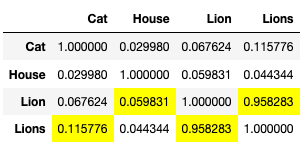
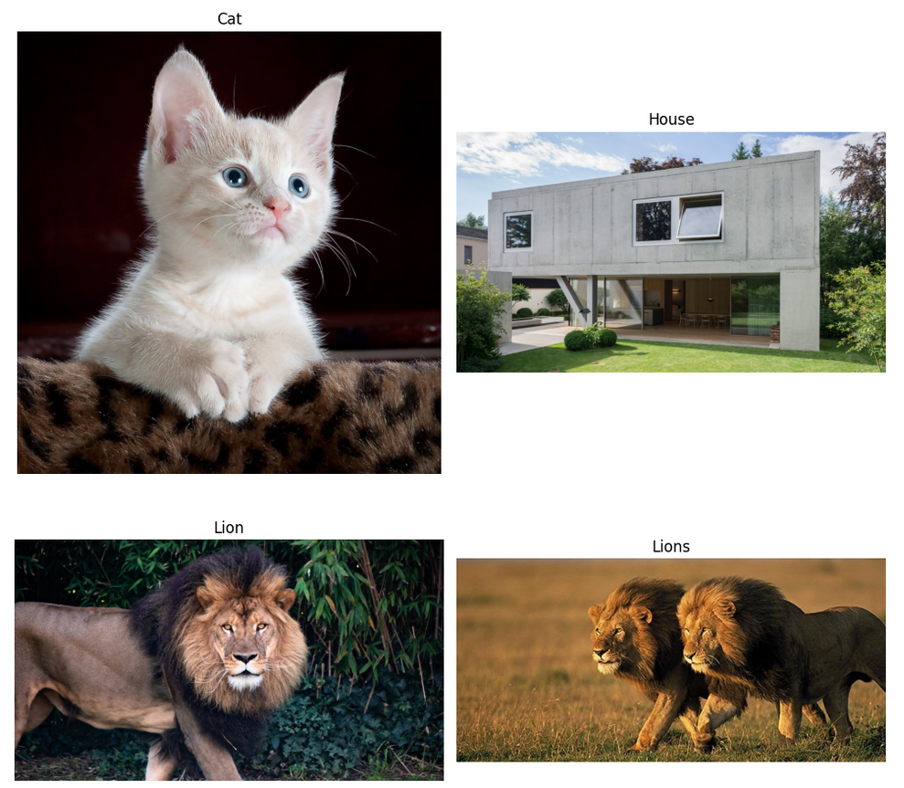
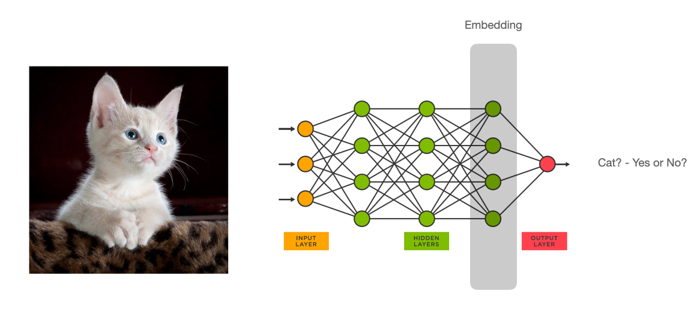

# Embeddings for Image Deduplication

In a project of mine I implemented an image deduplication approach based on embeddings.

## Results

I utilized a pre-trained model from Hugging Face to convert the images into embeddings, which are essentially vectors pointing in various directions within a multi-dimensional space. By calculating the cosine similarity between pairs of these vectors, we can compare and measure the similarity between the corresponding images. When the cosine similarity is closer to 1, it indicates a higher degree of similarity between the two images.

Here is a toy example:

## What are embeddings?

Image embeddings are compact numerical representations of images that capture their visual features and characteristics. Generated using deep learning techniques, these embeddings are obtained by passing images through pre-trained neural networks to extract high-level features. These features are then transformed into fixed-length vectors that encode the visual information of the images. Image embeddings enable efficient storage, retrieval, and comparison of images, facilitating tasks such as image search, similarity calculations, and downstream applications like image classification and object detection.

